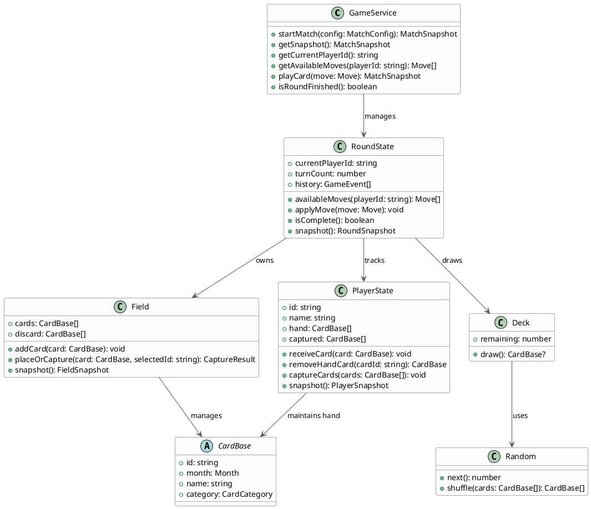

# ドメイン クラス図

以下は PlantUML を用いたドメイン主要クラスの関係図。`spec/class_diagram.puml` に同内容のソースを配置している。

```plantuml
@startuml DomainModel
skinparam backgroundColor #ffffff
skinparam shadowing false
skinparam class {
  BackgroundColor #fdfdff
  BorderColor #555555
  ArrowColor #555555
}

class GameService {
  +startMatch(config: MatchConfig): MatchSnapshot
  +getSnapshot(): MatchSnapshot
  +getCurrentPlayerId(): string
  +getAvailableMoves(playerId: string): Move[]
  +playCard(move: Move): MatchSnapshot
  +isRoundFinished(): boolean
}

class RoundState {
  +currentPlayerId: string
  +turnCount: number
  +history: GameEvent[]
  +availableMoves(playerId: string): Move[]
  +applyMove(move: Move): void
  +isComplete(): boolean
  +snapshot(): RoundSnapshot
}

class Field {
  +cards: CardBase[]
  +discard: CardBase[]
  +addCard(card: CardBase): void
  +placeOrCapture(card: CardBase, selectedId: string): CaptureResult
  +snapshot(): FieldSnapshot
}

class PlayerState {
  +id: string
  +name: string
  +hand: CardBase[]
  +captured: CardBase[]
  +receiveCard(card: CardBase): void
  +removeHandCard(cardId: string): CardBase
  +captureCards(cards: CardBase[]): void
  +snapshot(): PlayerSnapshot
}

class Deck {
  +draw(): CardBase?
  +remaining: number
}

class Random {
  +next(): number
  +shuffle(cards: CardBase[]): CardBase[]
}

abstract class CardBase {
  +id: string
  +month: Month
  +name: string
  +category: CardCategory
}

GameService --> RoundState : manages
RoundState --> Field : owns
RoundState --> PlayerState : tracks
RoundState --> Deck : draws
Deck --> Random : uses
PlayerState --> CardBase : maintains hand
Field --> CardBase : manages
@enduml
```
