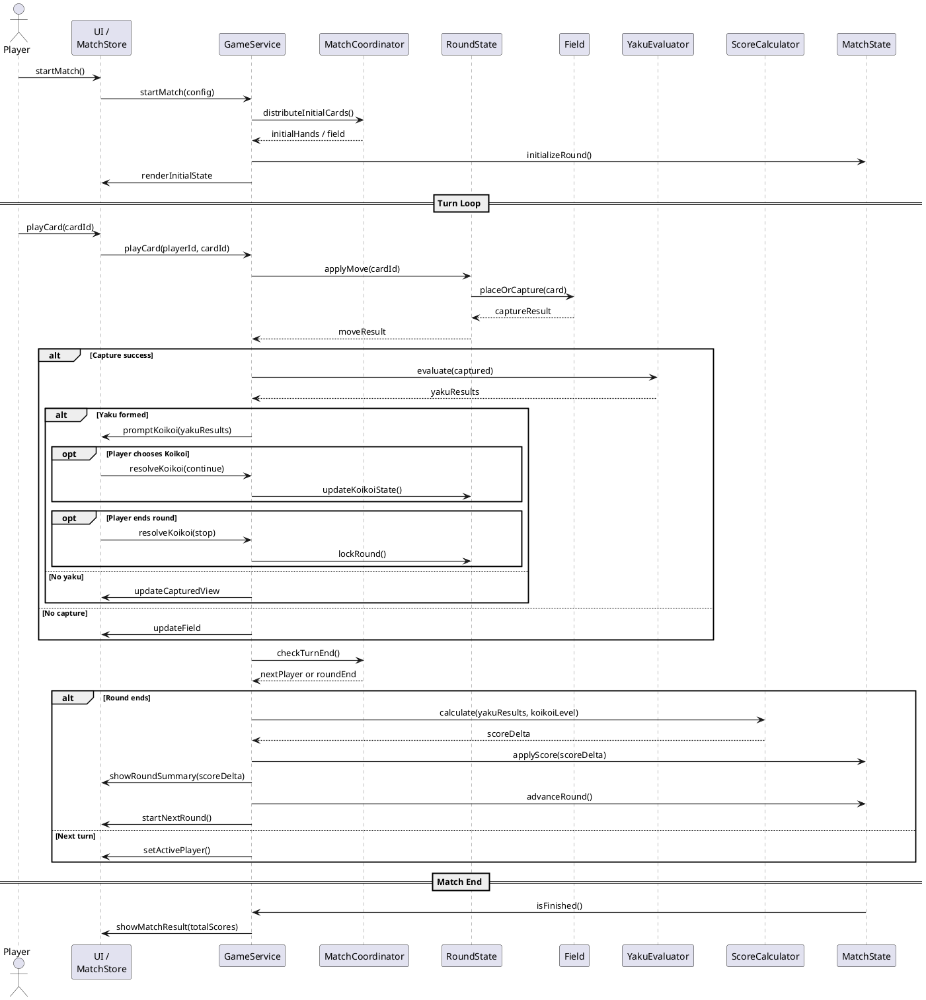

# ゲームフロー図

PlantUML によるシーケンス図で、こいこい1局の進行とマッチ全体の終端までを可視化する。ソースは `spec/game_flow.puml` にも保存している。

```plantuml
@startuml GameFlow
skinparam backgroundColor #ffffff
skinparam defaultTextAlignment center
skinparam participantPadding 20
skinparam shadowing false
skinparam ArrowThickness 1.2
skinparam SequenceLifeLineBorderColor #777777
skinparam SequenceLifeLineBackgroundColor #f9f9f9

actor Player as P
participant "UI /\nMatchStore" as UI
participant GameService as GS
participant MatchCoordinator as MC
participant RoundState as RS
participant Field as FD
participant YakuEvaluator as YE
participant ScoreCalculator as SC
participant MatchState as MS

P -> UI : startMatch()
UI -> GS : startMatch(config)
GS -> MC : distributeInitialCards()
MC --> GS : initialHands / field
GS -> MS : initializeRound()
GS -> UI : renderInitialState

== Turn Loop ==
P -> UI : playCard(cardId)
UI -> GS : playCard(playerId, cardId)
GS -> RS : applyMove(cardId)
RS -> FD : placeOrCapture(card)
FD --> RS : captureResult
RS --> GS : moveResult

alt Capture success
  GS -> YE : evaluate(captured)
  YE --> GS : yakuResults
  alt Yaku formed
    GS -> UI : promptKoikoi(yakuResults)
    opt Player chooses Koikoi
      UI -> GS : resolveKoikoi(continue)
      GS -> RS : updateKoikoiState()
    end
    opt Player ends round
      UI -> GS : resolveKoikoi(stop)
      GS -> RS : lockRound()
    end
  else No yaku
    GS -> UI : updateCapturedView
  end
else No capture
  GS -> UI : updateField
end

GS -> MC : checkTurnEnd()
MC --> GS : nextPlayer or roundEnd

alt Round ends
  GS -> SC : calculate(yakuResults, koikoiLevel)
  SC --> GS : scoreDelta
  GS -> MS : applyScore(scoreDelta)
  GS -> UI : showRoundSummary(scoreDelta)
  GS -> MS : advanceRound()
  GS -> UI : startNextRound()
else Next turn
  GS -> UI : setActivePlayer()
end

== Match End ==
MS -> GS : isFinished()
GS -> UI : showMatchResult(totalScores)
@enduml
```
