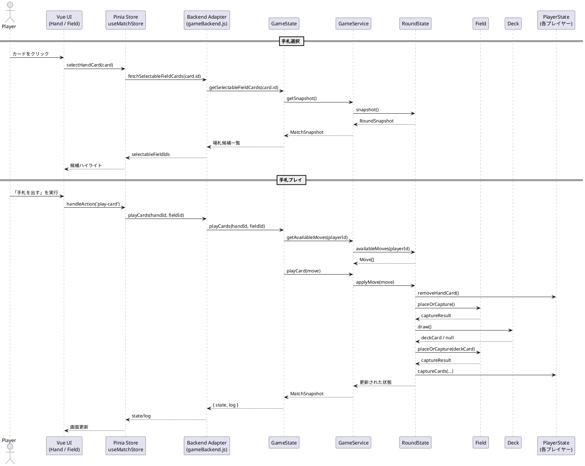

# ゲームフロー図

現状の実装が辿る 1 手番分のイベントフローを PlantUML のシーケンス図として整理した。ソースは `spec/game_flow.puml` にも保存している。

手札選択からプレイ完了までを 2 つのフェーズに分け、現行コードが直接利用しているコンポーネント（GameState → GameService → RoundState）とストア経由の UI 更新がどのように連携するかを明示した。
